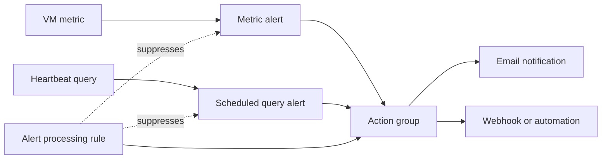

---
content_sources:
  diagrams:
    - id: architecture-diagram
      type: flowchart
      source: mslearn-adapted
      based_on:
        - https://learn.microsoft.com/en-us/azure/azure-monitor/alerts/alerts-overview
        - https://learn.microsoft.com/en-us/azure/azure-monitor/alerts/action-groups
        - https://learn.microsoft.com/en-us/azure/azure-monitor/alerts/alerts-metric-overview
        - https://learn.microsoft.com/en-us/azure/azure-monitor/alerts/alerts-types#log-search-alerts
        - https://learn.microsoft.com/en-us/azure/azure-monitor/alerts/alerts-processing-rules
---

# Lab 03: Azure Monitor Alerts

This lab turns monitoring data into action. You will create an action group, build metric and scheduled query alerts, and add an alert processing rule so your sandbox can model both detection and noise suppression patterns.

## Lab Metadata

| Attribute | Value |
|---|---|
| Difficulty | Intermediate |
| Estimated Duration | 45-60 minutes |
| Azure Monitor Tier | Detection and response |
| Primary Services | Metric alerts, scheduled query alerts, action groups, alert processing rules |
| Skills Practiced | Alert design, notification routing, rule scoping, suppression |

## Prerequisites

- Complete [Lab 01: Log Analytics Workspace Setup](lab-01-log-analytics-workspace-setup.md).
- Complete [Lab 02: Custom KQL Queries](lab-02-custom-kql-queries.md) if you want reusable KQL available.
- Azure CLI authenticated with `az login`.
- Permission to create action groups and alert rules.
- A VM or other resource emitting metrics and logs.

Set variables:

```bash
export RG="rg-monitoring-lab01"
export WORKSPACE_NAME="lawmonlab01"
export VM_NAME="vmmonlab01"
export ACTION_GROUP_NAME="ag-monitoring-lab03"
export METRIC_ALERT_NAME="alert-vm-high-cpu-lab03"
export LOG_ALERT_NAME="alert-heartbeat-missing-lab03"
export APR_NAME="apr-maintenance-window-lab03"

export WORKSPACE_ID=$(az monitor log-analytics workspace show \
    --resource-group "$RG" \
    --workspace-name "$WORKSPACE_NAME" \
    --query "id" \
    --output tsv)

export VM_ID=$(az vm show \
    --resource-group "$RG" \
    --name "$VM_NAME" \
    --query "id" \
    --output tsv)
```

## Architecture Diagram

<!-- diagram-id: architecture-diagram -->


## Lab Objectives

- Create an action group with a human notification target.
- Build a metric alert for CPU utilization.
- Build a log alert for missing heartbeat data.
- Test the underlying query logic before trusting the alert.
- Add an alert processing rule for maintenance or quiet hours.

## Step-by-Step Instructions

### Step 1: Create an action group

Replace `user@example.com` with a mailbox you control in the lab subscription.

```bash
az monitor action-group create \
    --name "$ACTION_GROUP_NAME" \
    --resource-group "$RG" \
    --short-name "monlab" \
    --action email "OpsEmail" user@example.com \
    --output json
```

Capture the action group resource ID:

```bash
export ACTION_GROUP_ID=$(az monitor action-group show \
    --name "$ACTION_GROUP_NAME" \
    --resource-group "$RG" \
    --query "id" \
    --output tsv)
```

### Step 2: Review available VM metrics

```bash
az monitor metrics list-definitions \
    --resource "$VM_ID" \
    --query "[?contains(name.value, 'CPU')].{metric:name.value,namespace:resourceId}" \
    --output table
```

This confirms the exact metric name before you create the rule.

### Step 3: Create a CPU metric alert

```bash
az monitor metrics alert create \
    --name "$METRIC_ALERT_NAME" \
    --resource-group "$RG" \
    --scopes "$VM_ID" \
    --condition "avg Percentage CPU > 80" \
    --window-size "5m" \
    --evaluation-frequency "1m" \
    --severity 2 \
    --description "Trigger when VM CPU average exceeds 80 percent for five minutes." \
    --action "$ACTION_GROUP_ID" \
    --output json
```

Read the rule back:

```bash
az monitor metrics alert show \
    --name "$METRIC_ALERT_NAME" \
    --resource-group "$RG" \
    --query "{name:name,severity:severity,enabled:enabled,windowSize:windowSize,evaluationFrequency:evaluationFrequency}" \
    --output json
```

### Step 4: Validate the heartbeat query before creating a log alert

```bash
az monitor log-analytics query \
    --workspace "$WORKSPACE_ID" \
    --analytics-query "Heartbeat | where Computer == '$VM_NAME' | where TimeGenerated > ago(15m) | summarize LastSeen=max(TimeGenerated), Beats=count() by Computer" \
    --output table
```

This baseline matters because a log alert is only as good as the query it evaluates.

### Step 5: Create a scheduled query alert

```bash
az monitor scheduled-query create \
    --name "$LOG_ALERT_NAME" \
    --resource-group "$RG" \
    --scopes "$WORKSPACE_ID" \
    --condition "count 'HeartbeatGap' > 0" \
    --condition-query "HeartbeatGap=Heartbeat | where Computer == '$VM_NAME' | summarize LastSeen=max(TimeGenerated) by Computer | where LastSeen < ago(10m)" \
    --evaluation-frequency "5m" \
    --window-size "10m" \
    --severity 2 \
    --skip-query-validation true \
    --action-groups "$ACTION_GROUP_ID" \
    --description "Trigger when the lab VM stops sending heartbeat records for more than ten minutes." \
    --output json
```

Review the scheduled query rule:

```bash
az monitor scheduled-query show \
    --name "$LOG_ALERT_NAME" \
    --resource-group "$RG" \
    --query "{name:name,severity:severity,enabled:enabled,evaluationFrequency:evaluationFrequency,windowSize:windowSize}" \
    --output json
```

### Step 6: Create an alert processing rule for planned maintenance

Use a recurrence that fits your own test window. The example below suppresses action groups during a short maintenance period.

```bash
az monitor alert-processing-rule create \
    --name "$APR_NAME" \
    --resource-group "$RG" \
    --scopes "$RG" \
    --rule-type "RemoveAllActionGroups" \
    --schedule "{\"effectiveFrom\":\"2026-04-07T22:00:00\",\"effectiveUntil\":\"2026-04-07T23:00:00\",\"timeZone\":\"UTC\"}" \
    --description "Suppress lab notifications during a planned maintenance window." \
    --output json
```

Read the processing rule back:

```bash
az monitor alert-processing-rule show \
    --name "$APR_NAME" \
    --resource-group "$RG" \
    --query "{name:name,enabled:enabled,scopes:scopes}" \
    --output json
```

### Step 7: Review all alert artifacts together

```bash
az monitor action-group list \
    --resource-group "$RG" \
    --query "[].{name:name,enabled:enabled}" \
    --output table
```

```bash
az monitor metrics alert list \
    --resource-group "$RG" \
    --query "[].{name:name,severity:severity,enabled:enabled}" \
    --output table
```

```bash
az monitor scheduled-query list \
    --resource-group "$RG" \
    --query "[].{name:name,severity:severity,enabled:enabled}" \
    --output table
```

## Validation Steps

Perform these checks before declaring success:

1. Confirm the action group exists and includes a receiver.

```bash
az monitor action-group show \
    --name "$ACTION_GROUP_NAME" \
    --resource-group "$RG" \
    --query "{name:name,shortName:groupShortName,emailReceivers:emailReceivers}" \
    --output json
```

2. Confirm the metric alert is enabled and scoped correctly.

```bash
az monitor metrics alert show \
    --name "$METRIC_ALERT_NAME" \
    --resource-group "$RG" \
    --query "{name:name,enabled:enabled,scopes:scopes}" \
    --output json
```

3. Confirm the log alert is enabled and references the workspace.

```bash
az monitor scheduled-query show \
    --name "$LOG_ALERT_NAME" \
    --resource-group "$RG" \
    --query "{name:name,enabled:enabled,scopes:scopes}" \
    --output json
```

4. Confirm the alert processing rule exists.

```bash
az monitor alert-processing-rule list \
    --resource-group "$RG" \
    --query "[].{name:name,enabled:enabled}" \
    --output table
```

Validation succeeds when the action group, metric alert, log alert, and alert processing rule are all present and enabled in the expected scope.

## Cleanup Instructions

If you are done with alerts, remove them in reverse dependency order:

```bash
az monitor alert-processing-rule delete \
    --name "$APR_NAME" \
    --resource-group "$RG"
```

```bash
az monitor scheduled-query delete \
    --name "$LOG_ALERT_NAME" \
    --resource-group "$RG"
```

```bash
az monitor metrics alert delete \
    --name "$METRIC_ALERT_NAME" \
    --resource-group "$RG"
```

```bash
az monitor action-group delete \
    --name "$ACTION_GROUP_NAME" \
    --resource-group "$RG"
```

Keep the workspace and VM if you are proceeding to later labs.

## See Also

- [Platform: Alerts Architecture](../../platform/alerts-architecture.md)
- [Operations: Alert Rule Management](../../operations/alert-rule-management.md)
- [Lab 05: Workbooks and Dashboards](lab-05-workbooks-and-dashboards.md)

## Sources

- [Azure Monitor alerts overview](https://learn.microsoft.com/en-us/azure/azure-monitor/alerts/alerts-overview)
- [Create and manage action groups](https://learn.microsoft.com/en-us/azure/azure-monitor/alerts/action-groups)
- [Metric alerts in Azure Monitor](https://learn.microsoft.com/en-us/azure/azure-monitor/alerts/alerts-metric-overview)
- [Log search alerts in Azure Monitor](https://learn.microsoft.com/en-us/azure/azure-monitor/alerts/alerts-types#log-search-alerts)
- [Alert processing rules](https://learn.microsoft.com/en-us/azure/azure-monitor/alerts/alerts-processing-rules)
