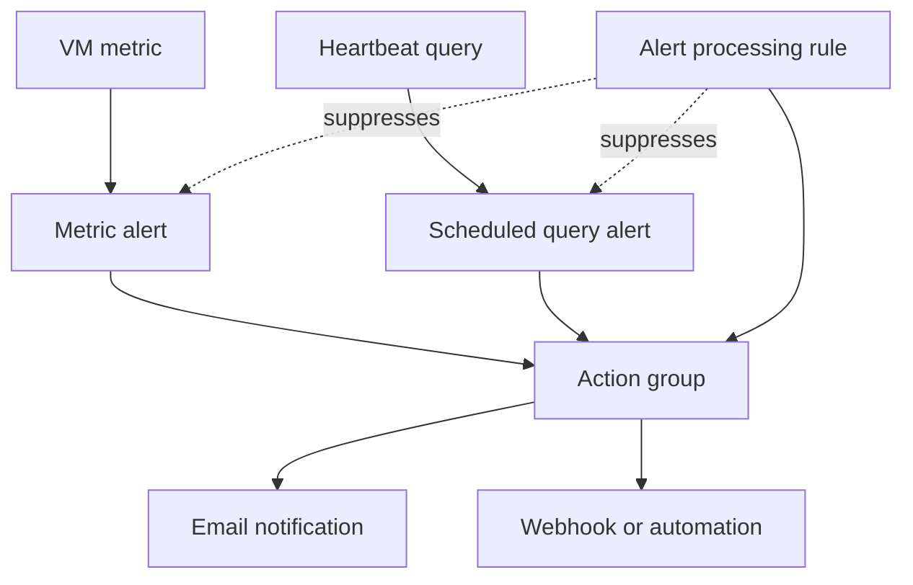

---
content_sources:
  diagrams:
    - id: architecture-diagram
      type: flowchart
      source: mslearn-adapted
      based_on:
        - https://learn.microsoft.com/en-us/azure/azure-monitor/alerts/alerts-overview
        - https://learn.microsoft.com/en-us/azure/azure-monitor/alerts/action-groups
        - https://learn.microsoft.com/en-us/azure/azure-monitor/alerts/alerts-metric-overview
        - https://learn.microsoft.com/en-us/azure/azure-monitor/alerts/alerts-types#log-search-alerts
        - https://learn.microsoft.com/en-us/azure/azure-monitor/alerts/alerts-processing-rules
---

# Lab 03: Azure Monitor Alerts

This lab turns monitoring data into action. You will create an action group, build metric and scheduled query alerts, and add an alert processing rule so your sandbox can model both detection and noise suppression patterns.

## Lab Metadata

| Attribute | Value |
|---|---|
| Difficulty | Intermediate |
| Estimated Duration | 45-60 minutes |
| Azure Monitor Tier | Detection and response |
| Primary Services | Metric alerts, scheduled query alerts, action groups, alert processing rules |
| Skills Practiced | Alert design, notification routing, rule scoping, suppression |

## Prerequisites

- Complete [Lab 01: Log Analytics Workspace Setup](lab-01-log-analytics-workspace-setup.md).
- Complete [Lab 02: Custom KQL Queries](lab-02-custom-kql-queries.md) if you want reusable KQL available.
- Azure CLI authenticated with `az login`.
- Permission to create action groups and alert rules.
- A VM or other resource emitting metrics and logs.

Set variables:

```bash
export RG="rg-monitoring-lab01"
export WORKSPACE_NAME="lawmonlab01"
export VM_NAME="vmmonlab01"
export ACTION_GROUP_NAME="ag-monitoring-lab03"
export METRIC_ALERT_NAME="alert-vm-high-cpu-lab03"
export LOG_ALERT_NAME="alert-heartbeat-missing-lab03"
export APR_NAME="apr-maintenance-window-lab03"

export WORKSPACE_ID=$(az monitor log-analytics workspace show \
    --resource-group "$RG" \
    --workspace-name "$WORKSPACE_NAME" \
    --query "id" \
    --output tsv)

export VM_ID=$(az vm show \
    --resource-group "$RG" \
    --name "$VM_NAME" \
    --query "id" \
    --output tsv)
```

| Command | Purpose |
| --- | --- |
| `az monitor log-analytics workspace show` | Show a Log Analytics workspace. |
| `--resource-group` | Resource group that contains the resource. |
| `--workspace-name` | Name of the Log Analytics workspace. |
| `--query` | JMESPath projection of the fields to return. |
| `--output` | Output format for the result. |
| `az vm show` | Show properties of a virtual machine. |
| `--resource-group` | Resource group that contains the resource. |
| `--name` | Name of the resource. |
| `--query` | JMESPath projection of the fields to return. |
| `--output` | Output format for the result. |

## Architecture Diagram

<!-- diagram-id: architecture-diagram -->

```mermaid
flowchart TD
    Metric[VM metric] --> MA[Metric alert]
    Log[Heartbeat query] --> LQA[Scheduled query alert]
    MA --> AG[Action group]
    LQA --> AG
    AG --> Email[Email notification]
    AG --> Webhook[Webhook or automation]
    APR[Alert processing rule] --> AG
    APR -. suppresses .-> MA
    APR -. suppresses .-> LQA
```

## Lab Objectives

- Create an action group with a human notification target.
- Build a metric alert for CPU utilization.
- Build a log alert for missing heartbeat data.
- Test the underlying query logic before trusting the alert.
- Add an alert processing rule for maintenance or quiet hours.

## Step-by-Step Instructions

### Step 1: Create an action group

Replace `user@example.com` with a mailbox you control in the lab subscription.

```bash
az monitor action-group create \
    --name "$ACTION_GROUP_NAME" \
    --resource-group "$RG" \
    --short-name "monlab" \
    --action email "OpsEmail" user@example.com \
    --output json
```

| Command | Purpose |
| --- | --- |
| `az monitor action-group create` | Create an action group for alert notifications. |
| `--name` | Name of the resource. |
| `--resource-group` | Resource group that contains the resource. |
| `--short-name` | Short name used in alert notifications. |
| `--action` | Action group or webhook to invoke when the alert fires. |
| `--output` | Output format for the result. |

Capture the action group resource ID:

```bash
export ACTION_GROUP_ID=$(az monitor action-group show \
    --name "$ACTION_GROUP_NAME" \
    --resource-group "$RG" \
    --query "id" \
    --output tsv)
```

| Command | Purpose |
| --- | --- |
| `az monitor action-group show` | Show an action group. |
| `--name` | Name of the resource. |
| `--resource-group` | Resource group that contains the resource. |
| `--query` | JMESPath projection of the fields to return. |
| `--output` | Output format for the result. |

### Step 2: Review available VM metrics

```bash
az monitor metrics list-definitions \
    --resource "$VM_ID" \
    --query "[?contains(name.value, 'CPU')].{metric:name.value,namespace:resourceId}" \
    --output table
```

| Command | Purpose |
| --- | --- |
| `az monitor metrics list-definitions` | List available metric definitions for a resource. |
| `--resource` | Target resource ID or name for the operation. |
| `--query` | JMESPath projection of the fields to return. |
| `--output` | Output format for the result. |

This confirms the exact metric name before you create the rule.

### Step 3: Create a CPU metric alert

```bash
az monitor metrics alert create \
    --name "$METRIC_ALERT_NAME" \
    --resource-group "$RG" \
    --scopes "$VM_ID" \
    --condition "avg Percentage CPU > 80" \
    --window-size "5m" \
    --evaluation-frequency "1m" \
    --severity 2 \
    --description "Trigger when VM CPU average exceeds 80 percent for five minutes." \
    --action "$ACTION_GROUP_ID" \
    --output json
```

| Command | Purpose |
| --- | --- |
| `az monitor metrics alert create` | Create a metric alert rule. |
| `--name` | Name of the resource. |
| `--resource-group` | Resource group that contains the resource. |
| `--scopes` | Target resource scopes for the alert rule. |
| `--condition` | Condition expression that triggers the alert. |
| `--window-size` | Time window over which the condition is evaluated. |
| `--evaluation-frequency` | How often the alert rule is evaluated. |
| `--severity` | Severity level of the alert. |
| `--description` | Human-readable description of the resource. |
| `--action` | Action group or webhook to invoke when the alert fires. |
| `--output` | Output format for the result. |

Read the rule back:

```bash
az monitor metrics alert show \
    --name "$METRIC_ALERT_NAME" \
    --resource-group "$RG" \
    --query "{name:name,severity:severity,enabled:enabled,windowSize:windowSize,evaluationFrequency:evaluationFrequency}" \
    --output json
```

| Command | Purpose |
| --- | --- |
| `az monitor metrics alert show` | Show a metric alert rule. |
| `--name` | Name of the resource. |
| `--resource-group` | Resource group that contains the resource. |
| `--query` | JMESPath projection of the fields to return. |
| `--output` | Output format for the result. |

### Step 4: Validate the heartbeat query before creating a log alert

```bash
az monitor log-analytics query \
    --workspace "$WORKSPACE_ID" \
    --analytics-query "Heartbeat | where Computer == '$VM_NAME' | where TimeGenerated > ago(15m) | summarize LastSeen=max(TimeGenerated), Beats=count() by Computer" \
    --output table
```

| Command | Purpose |
| --- | --- |
| `az monitor log-analytics query` | Run a KQL query against a Log Analytics workspace. |
| `--workspace` | Log Analytics workspace ID for the query. |
| `--analytics-query` | Kusto (KQL) query to execute. |
| `--output` | Output format for the result. |

This baseline matters because a log alert is only as good as the query it evaluates.

### Step 5: Create a scheduled query alert

```bash
az monitor scheduled-query create \
    --name "$LOG_ALERT_NAME" \
    --resource-group "$RG" \
    --scopes "$WORKSPACE_ID" \
    --condition "count 'HeartbeatGap' > 0" \
    --condition-query "HeartbeatGap=Heartbeat | where Computer == '$VM_NAME' | summarize LastSeen=max(TimeGenerated) by Computer | where LastSeen < ago(10m)" \
    --evaluation-frequency "5m" \
    --window-size "10m" \
    --severity 2 \
    --skip-query-validation true \
    --action-groups "$ACTION_GROUP_ID" \
    --description "Trigger when the lab VM stops sending heartbeat records for more than ten minutes." \
    --output json
```

| Command | Purpose |
| --- | --- |
| `az monitor scheduled-query create` | Create a scheduled query (log) alert rule. |
| `--name` | Name of the resource. |
| `--resource-group` | Resource group that contains the resource. |
| `--scopes` | Target resource scopes for the alert rule. |
| `--condition` | Condition expression that triggers the alert. |
| `--condition-query` | Named query referenced by the alert condition. |
| `--evaluation-frequency` | How often the alert rule is evaluated. |
| `--window-size` | Time window over which the condition is evaluated. |
| `--severity` | Severity level of the alert. |
| `--skip-query-validation` | Skips server-side validation of the query. |
| `--action-groups` | Action groups notified when the alert fires. |
| `--description` | Human-readable description of the resource. |
| `--output` | Output format for the result. |

Review the scheduled query rule:

```bash
az monitor scheduled-query show \
    --name "$LOG_ALERT_NAME" \
    --resource-group "$RG" \
    --query "{name:name,severity:severity,enabled:enabled,evaluationFrequency:evaluationFrequency,windowSize:windowSize}" \
    --output json
```

| Command | Purpose |
| --- | --- |
| `az monitor scheduled-query show` | Show a scheduled query alert rule. |
| `--name` | Name of the resource. |
| `--resource-group` | Resource group that contains the resource. |
| `--query` | JMESPath projection of the fields to return. |
| `--output` | Output format for the result. |

### Step 6: Create an alert processing rule for planned maintenance

Use a recurrence that fits your own test window. The example below suppresses action groups during a short maintenance period.

```bash
az monitor alert-processing-rule create \
    --name "$APR_NAME" \
    --resource-group "$RG" \
    --scopes "$RG" \
    --rule-type "RemoveAllActionGroups" \
    --schedule "{\"effectiveFrom\":\"2026-04-07T22:00:00\",\"effectiveUntil\":\"2026-04-07T23:00:00\",\"timeZone\":\"UTC\"}" \
    --description "Suppress lab notifications during a planned maintenance window." \
    --output json
```

| Command | Purpose |
| --- | --- |
| `az monitor alert-processing-rule create` | Create an alert processing rule. |
| `--name` | Name of the resource. |
| `--resource-group` | Resource group that contains the resource. |
| `--scopes` | Target resource scopes for the alert rule. |
| `--rule-type` | Type of the rule resource. |
| `--schedule` | Schedule expression for the rule. |
| `--description` | Human-readable description of the resource. |
| `--output` | Output format for the result. |

Read the processing rule back:

```bash
az monitor alert-processing-rule show \
    --name "$APR_NAME" \
    --resource-group "$RG" \
    --query "{name:name,enabled:enabled,scopes:scopes}" \
    --output json
```

| Command | Purpose |
| --- | --- |
| `az monitor alert-processing-rule show` | Show an alert processing rule. |
| `--name` | Name of the resource. |
| `--resource-group` | Resource group that contains the resource. |
| `--query` | JMESPath projection of the fields to return. |
| `--output` | Output format for the result. |

### Step 7: Review all alert artifacts together

```bash
az monitor action-group list \
    --resource-group "$RG" \
    --query "[].{name:name,enabled:enabled}" \
    --output table
```

| Command | Purpose |
| --- | --- |
| `az monitor action-group list` | List action groups. |
| `--resource-group` | Resource group that contains the resource. |
| `--query` | JMESPath projection of the fields to return. |
| `--output` | Output format for the result. |

```bash
az monitor metrics alert list \
    --resource-group "$RG" \
    --query "[].{name:name,severity:severity,enabled:enabled}" \
    --output table
```

| Command | Purpose |
| --- | --- |
| `az monitor metrics alert list` | List metric alert rules. |
| `--resource-group` | Resource group that contains the resource. |
| `--query` | JMESPath projection of the fields to return. |
| `--output` | Output format for the result. |

```bash
az monitor scheduled-query list \
    --resource-group "$RG" \
    --query "[].{name:name,severity:severity,enabled:enabled}" \
    --output table
```

| Command | Purpose |
| --- | --- |
| `az monitor scheduled-query list` | List scheduled query alert rules. |
| `--resource-group` | Resource group that contains the resource. |
| `--query` | JMESPath projection of the fields to return. |
| `--output` | Output format for the result. |

## Validation Steps

Perform these checks before declaring success:

1. Confirm the action group exists and includes a receiver.

```bash
az monitor action-group show \
    --name "$ACTION_GROUP_NAME" \
    --resource-group "$RG" \
    --query "{name:name,shortName:groupShortName,emailReceivers:emailReceivers}" \
    --output json
```

| Command | Purpose |
| --- | --- |
| `az monitor action-group show` | Show an action group. |
| `--name` | Name of the resource. |
| `--resource-group` | Resource group that contains the resource. |
| `--query` | JMESPath projection of the fields to return. |
| `--output` | Output format for the result. |

2. Confirm the metric alert is enabled and scoped correctly.

```bash
az monitor metrics alert show \
    --name "$METRIC_ALERT_NAME" \
    --resource-group "$RG" \
    --query "{name:name,enabled:enabled,scopes:scopes}" \
    --output json
```

| Command | Purpose |
| --- | --- |
| `az monitor metrics alert show` | Show a metric alert rule. |
| `--name` | Name of the resource. |
| `--resource-group` | Resource group that contains the resource. |
| `--query` | JMESPath projection of the fields to return. |
| `--output` | Output format for the result. |

3. Confirm the log alert is enabled and references the workspace.

```bash
az monitor scheduled-query show \
    --name "$LOG_ALERT_NAME" \
    --resource-group "$RG" \
    --query "{name:name,enabled:enabled,scopes:scopes}" \
    --output json
```

| Command | Purpose |
| --- | --- |
| `az monitor scheduled-query show` | Show a scheduled query alert rule. |
| `--name` | Name of the resource. |
| `--resource-group` | Resource group that contains the resource. |
| `--query` | JMESPath projection of the fields to return. |
| `--output` | Output format for the result. |

4. Confirm the alert processing rule exists.

```bash
az monitor alert-processing-rule list \
    --resource-group "$RG" \
    --query "[].{name:name,enabled:enabled}" \
    --output table
```

| Command | Purpose |
| --- | --- |
| `az monitor alert-processing-rule list` | List alert processing rules. |
| `--resource-group` | Resource group that contains the resource. |
| `--query` | JMESPath projection of the fields to return. |
| `--output` | Output format for the result. |

Validation succeeds when the action group, metric alert, log alert, and alert processing rule are all present and enabled in the expected scope.

## Cleanup Instructions

If you are done with alerts, remove them in reverse dependency order:

```bash
az monitor alert-processing-rule delete \
    --name "$APR_NAME" \
    --resource-group "$RG"
```

| Command | Purpose |
| --- | --- |
| `az monitor alert-processing-rule delete` | Delete an alert processing rule. |
| `--name` | Name of the resource. |
| `--resource-group` | Resource group that contains the resource. |

```bash
az monitor scheduled-query delete \
    --name "$LOG_ALERT_NAME" \
    --resource-group "$RG"
```

| Command | Purpose |
| --- | --- |
| `az monitor scheduled-query delete` | Delete a scheduled query alert rule. |
| `--name` | Name of the resource. |
| `--resource-group` | Resource group that contains the resource. |

```bash
az monitor metrics alert delete \
    --name "$METRIC_ALERT_NAME" \
    --resource-group "$RG"
```

| Command | Purpose |
| --- | --- |
| `az monitor metrics alert delete` | Delete a metric alert rule. |
| `--name` | Name of the resource. |
| `--resource-group` | Resource group that contains the resource. |

```bash
az monitor action-group delete \
    --name "$ACTION_GROUP_NAME" \
    --resource-group "$RG"
```

| Command | Purpose |
| --- | --- |
| `az monitor action-group delete` | Delete an action group. |
| `--name` | Name of the resource. |
| `--resource-group` | Resource group that contains the resource. |

Keep the workspace and VM if you are proceeding to later labs.

## See Also

- [Platform: Alerts Architecture](../../platform/alerts-architecture.md)
- [Operations: Alert Rule Management](../../operations/alert-rule-management.md)
- [Lab 05: Workbooks and Dashboards](lab-05-workbooks-and-dashboards.md)

## Sources

- [Azure Monitor alerts overview](https://learn.microsoft.com/en-us/azure/azure-monitor/alerts/alerts-overview)
- [Create and manage action groups](https://learn.microsoft.com/en-us/azure/azure-monitor/alerts/action-groups)
- [Metric alerts in Azure Monitor](https://learn.microsoft.com/en-us/azure/azure-monitor/alerts/alerts-metric-overview)
- [Log search alerts in Azure Monitor](https://learn.microsoft.com/en-us/azure/azure-monitor/alerts/alerts-types#log-search-alerts)
- [Alert processing rules](https://learn.microsoft.com/en-us/azure/azure-monitor/alerts/alerts-processing-rules)
