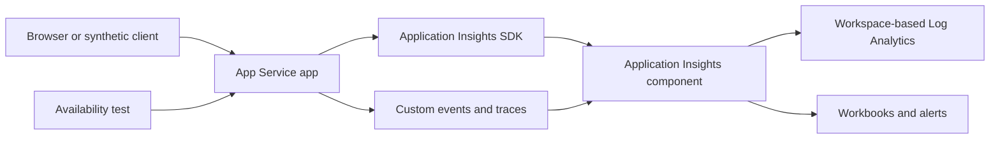

# Lab 04: Application Insights Setup

This lab adds application performance monitoring to the sandbox. You will create an Application Insights resource, configure a sample App Service to send telemetry, emit custom events and traces, and create an availability test to verify end-user reachability.

## Lab Metadata

| Attribute | Value |
|---|---|
| Difficulty | Intermediate |
| Estimated Duration | 45-60 minutes |
| Azure Monitor Tier | Application telemetry |
| Primary Services | Application Insights, App Service, availability tests |
| Skills Practiced | Instrumentation, connection strings, custom telemetry, validation |

## Prerequisites

- Azure CLI authenticated with `az login`.
- Permission to create Application Insights resources and App Service resources.
- A sandbox resource group in the same subscription as the Log Analytics workspace.
- Familiarity with connection strings and application settings.

Set variables for the lab:

```bash
export LOCATION="koreacentral"
export RG="rg-monitoring-lab04"
export WORKSPACE_NAME="lawmonlab04"
export APP_INSIGHTS_NAME="appimonlab04"
export PLAN_NAME="aspmonlab04"
export WEBAPP_NAME="webmonlab04demo"
export WEB_TEST_NAME="webtest-monlab04"
```

## Architecture Diagram



## Lab Objectives

- Create a workspace-based Application Insights component.
- Deploy a minimal App Service app and configure its connection string.
- Generate requests, traces, and custom telemetry.
- Confirm telemetry lands in `requests`, `traces`, and `customEvents` tables.
- Create an availability test that probes the app endpoint.

## Step-by-Step Instructions

### Step 1: Create the resource group and workspace

```bash
az group create \
    --name "$RG" \
    --location "$LOCATION" \
    --output json
```

```bash
az monitor log-analytics workspace create \
    --resource-group "$RG" \
    --workspace-name "$WORKSPACE_NAME" \
    --location "$LOCATION" \
    --sku "PerGB2018" \
    --retention-time 30 \
    --output json
```

Capture the workspace ID:

```bash
export WORKSPACE_ID=$(az monitor log-analytics workspace show \
    --resource-group "$RG" \
    --workspace-name "$WORKSPACE_NAME" \
    --query "id" \
    --output tsv)
```

### Step 2: Create a workspace-based Application Insights resource

```bash
az monitor app-insights component create \
    --app "$APP_INSIGHTS_NAME" \
    --location "$LOCATION" \
    --resource-group "$RG" \
    --workspace "$WORKSPACE_ID" \
    --application-type "web" \
    --kind "web" \
    --output json
```

Retrieve the connection string:

```bash
export APPINSIGHTS_CONNECTION_STRING=$(az monitor app-insights component show \
    --app "$APP_INSIGHTS_NAME" \
    --resource-group "$RG" \
    --query "connectionString" \
    --output tsv)
```

### Step 3: Create an App Service plan and web app

```bash
az appservice plan create \
    --name "$PLAN_NAME" \
    --resource-group "$RG" \
    --location "$LOCATION" \
    --sku "B1" \
    --is-linux \
    --output json
```

```bash
az webapp create \
    --name "$WEBAPP_NAME" \
    --resource-group "$RG" \
    --plan "$PLAN_NAME" \
    --runtime "PYTHON:3.11" \
    --output json
```

### Step 4: Configure application settings for telemetry

```bash
az webapp config appsettings set \
    --name "$WEBAPP_NAME" \
    --resource-group "$RG" \
    --settings \
        APPLICATIONINSIGHTS_CONNECTION_STRING="$APPINSIGHTS_CONNECTION_STRING" \
        SCM_DO_BUILD_DURING_DEPLOYMENT="true" \
    --output json
```

Optionally enable App Service logs for troubleshooting during instrumentation.

```bash
az webapp log config \
    --name "$WEBAPP_NAME" \
    --resource-group "$RG" \
    --application-logging filesystem \
    --level information \
    --detailed-error-messages true \
    --failed-request-tracing true \
    --web-server-logging filesystem
```

### Step 5: Generate requests and custom telemetry

For a real app, deploy code that uses an Application Insights SDK. The example below uses `az webapp ssh` only as a placeholder workflow; in practice you would deploy source code that sends traces, dependencies, and custom events.

Suggested application patterns:

```python
from applicationinsights import TelemetryClient

tc = TelemetryClient("<connection-string>")
tc.track_trace("lab-start")
tc.track_event("checkout-demo", {"region": "lab"}, {"durationMs": 125})
tc.flush()
```

Generate inbound traffic to the web app:

```bash
export APP_URL=$(az webapp show \
    --name "$WEBAPP_NAME" \
    --resource-group "$RG" \
    --query "defaultHostName" \
    --output tsv)
```

```bash
az rest \
    --method get \
    --url "https://$APP_URL/"
```

Repeat the request a few times so the `requests` table has fresh rows.

### Step 6: Query Application Insights tables in the workspace

```bash
az monitor log-analytics query \
    --workspace "$WORKSPACE_ID" \
    --analytics-query "requests | where timestamp > ago(30m) | summarize RequestCount=count(), AvgDurationMs=avg(duration) by cloud_RoleName" \
    --output table
```

```bash
az monitor log-analytics query \
    --workspace "$WORKSPACE_ID" \
    --analytics-query "traces | where timestamp > ago(30m) | summarize TraceCount=count() by severityLevel" \
    --output table
```

```bash
az monitor log-analytics query \
    --workspace "$WORKSPACE_ID" \
    --analytics-query "customEvents | where timestamp > ago(30m) | summarize EventCount=count() by name" \
    --output table
```

### Step 7: Create an availability test

Use a standard ping-style web test for the app endpoint.

```bash
az monitor app-insights web-test create \
    --resource-group "$RG" \
    --name "$WEB_TEST_NAME" \
    --location "$LOCATION" \
    --web-test-kind "ping" \
    --frequency 300 \
    --timeout 120 \
    --enabled true \
    --request-url "https://$APP_URL" \
    --output json
```

List the test to confirm it exists:

```bash
az monitor app-insights web-test show \
    --resource-group "$RG" \
    --name "$WEB_TEST_NAME" \
    --output json
```

### Step 8: Review component settings

```bash
az monitor app-insights component show \
    --app "$APP_INSIGHTS_NAME" \
    --resource-group "$RG" \
    --query "{name:name,workspaceResourceId:workspaceResourceId,applicationType:applicationType,connectionString:connectionString}" \
    --output json
```

This confirms the component is workspace-based and ready for alerts and workbooks.

## Validation Steps

Run these checks:

1. Confirm the component is linked to the workspace.

```bash
az monitor app-insights component show \
    --app "$APP_INSIGHTS_NAME" \
    --resource-group "$RG" \
    --query "{name:name,workspaceResourceId:workspaceResourceId}" \
    --output json
```

2. Confirm the App Service app has the connection string setting.

```bash
az webapp config appsettings list \
    --name "$WEBAPP_NAME" \
    --resource-group "$RG" \
    --query "[?name=='APPLICATIONINSIGHTS_CONNECTION_STRING']" \
    --output json
```

3. Confirm request telemetry is arriving.

```bash
az monitor log-analytics query \
    --workspace "$WORKSPACE_ID" \
    --analytics-query "requests | where timestamp > ago(30m) | summarize Count=count()" \
    --output table
```

4. Confirm the availability test exists.

```bash
az monitor app-insights web-test list \
    --resource-group "$RG" \
    --output table
```

Validation succeeds when the Application Insights component is workspace-based, the web app contains the connection string, telemetry is queryable, and the availability test is present.

## Cleanup Instructions

If you want to remove just the availability test:

```bash
az monitor app-insights web-test delete \
    --resource-group "$RG" \
    --name "$WEB_TEST_NAME"
```

If you want to delete the full lab environment:

```bash
az group delete \
    --name "$RG" \
    --yes \
    --no-wait
```

## See Also

- [Platform: Application Insights](../../platform/application-insights.md)
- [Service Guides: App Service Application Insights Integration](../../service-guides/app-service/application-insights-integration.md)
- [Lab 05: Workbooks and Dashboards](lab-05-workbooks-and-dashboards.md)

## Sources

- [Application Insights overview](https://learn.microsoft.com/en-us/azure/azure-monitor/app/app-insights-overview)
- [Create an Application Insights resource](https://learn.microsoft.com/en-us/azure/azure-monitor/app/create-workspace-resource)
- [Monitor availability with URL ping tests](https://learn.microsoft.com/en-us/azure/azure-monitor/app/availability)
- [Monitor Azure App Service](https://learn.microsoft.com/en-us/azure/azure-monitor/app/azure-web-apps)
