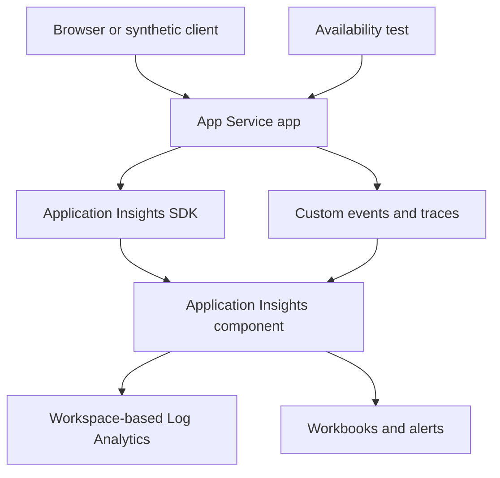

---
content_sources:
  diagrams:
    - id: architecture-diagram
      type: flowchart
      source: mslearn-adapted
      based_on:
        - https://learn.microsoft.com/en-us/azure/azure-monitor/app/app-insights-overview
        - https://learn.microsoft.com/en-us/azure/azure-monitor/app/create-workspace-resource
        - https://learn.microsoft.com/en-us/azure/azure-monitor/app/availability
        - https://learn.microsoft.com/en-us/azure/azure-monitor/app/azure-web-apps
---

# Lab 04: Application Insights Setup

This lab adds application performance monitoring to the sandbox. You will create an Application Insights resource, configure a sample App Service to send telemetry, emit custom events and traces, and create an availability test to verify end-user reachability.

## Lab Metadata

| Attribute | Value |
|---|---|
| Difficulty | Intermediate |
| Estimated Duration | 45-60 minutes |
| Azure Monitor Tier | Application telemetry |
| Primary Services | Application Insights, App Service, availability tests |
| Skills Practiced | Instrumentation, connection strings, custom telemetry, validation |

## Prerequisites

- Azure CLI authenticated with `az login`.
- Permission to create Application Insights resources and App Service resources.
- A sandbox resource group in the same subscription as the Log Analytics workspace.
- Familiarity with connection strings and application settings.

Set variables for the lab:

```bash
export LOCATION="koreacentral"
export RG="rg-monitoring-lab04"
export WORKSPACE_NAME="lawmonlab04"
export APP_INSIGHTS_NAME="appimonlab04"
export PLAN_NAME="aspmonlab04"
export WEBAPP_NAME="webmonlab04demo"
export WEB_TEST_NAME="webtest-monlab04"
```

## Architecture Diagram

<!-- diagram-id: architecture-diagram -->

```mermaid
flowchart TD
    User[Browser or synthetic client] --> App[App Service app]
    App --> SDK[Application Insights SDK]
    SDK --> AI[Application Insights component]
    AI --> LAW[Workspace-based Log Analytics]
    App --> Custom[Custom events and traces]
    Custom --> AI
    Test[Availability test] --> App
    AI --> Workbook[Workbooks and alerts]
```

## Lab Objectives

- Create a workspace-based Application Insights component.
- Deploy a minimal App Service app and configure its connection string.
- Generate requests, traces, and custom telemetry.
- Confirm telemetry lands in `requests`, `traces`, and `customEvents` tables.
- Create an availability test that probes the app endpoint.

## Step-by-Step Instructions

### Step 1: Create the resource group and workspace

```bash
az group create \
    --name "$RG" \
    --location "$LOCATION" \
    --output json
```

| Command | Purpose |
| --- | --- |
| `az group create` | Create a resource group. |
| `--name` | Name of the resource. |
| `--location` | Azure region for the resource. |
| `--output` | Output format for the result. |

```bash
az monitor log-analytics workspace create \
    --resource-group "$RG" \
    --workspace-name "$WORKSPACE_NAME" \
    --location "$LOCATION" \
    --sku "PerGB2018" \
    --retention-time 30 \
    --output json
```

| Command | Purpose |
| --- | --- |
| `az monitor log-analytics workspace create` | Create a Log Analytics workspace. |
| `--resource-group` | Resource group that contains the resource. |
| `--workspace-name` | Name of the Log Analytics workspace. |
| `--location` | Azure region for the resource. |
| `--sku` | SKU tier of the resource. |
| `--retention-time` | Data retention period in days. |
| `--output` | Output format for the result. |

Capture the workspace ID:

```bash
export WORKSPACE_ID=$(az monitor log-analytics workspace show \
    --resource-group "$RG" \
    --workspace-name "$WORKSPACE_NAME" \
    --query "id" \
    --output tsv)
```

| Command | Purpose |
| --- | --- |
| `az monitor log-analytics workspace show` | Show a Log Analytics workspace. |
| `--resource-group` | Resource group that contains the resource. |
| `--workspace-name` | Name of the Log Analytics workspace. |
| `--query` | JMESPath projection of the fields to return. |
| `--output` | Output format for the result. |

### Step 2: Create a workspace-based Application Insights resource

```bash
az monitor app-insights component create \
    --app "$APP_INSIGHTS_NAME" \
    --location "$LOCATION" \
    --resource-group "$RG" \
    --workspace "$WORKSPACE_ID" \
    --application-type "web" \
    --kind "web" \
    --output json
```

| Command | Purpose |
| --- | --- |
| `az monitor app-insights component create` | Create an Application Insights component. |
| `--app` | Application Insights component name. |
| `--location` | Azure region for the resource. |
| `--resource-group` | Resource group that contains the resource. |
| `--workspace` | Log Analytics workspace ID for the query. |
| `--application-type` | Application Insights application type. |
| `--kind` | Resource kind. |
| `--output` | Output format for the result. |

Retrieve the connection string:

```bash
export APPINSIGHTS_CONNECTION_STRING=$(az monitor app-insights component show \
    --app "$APP_INSIGHTS_NAME" \
    --resource-group "$RG" \
    --query "connectionString" \
    --output tsv)
```

| Command | Purpose |
| --- | --- |
| `az monitor app-insights component show` | Show an Application Insights component. |
| `--app` | Application Insights component name. |
| `--resource-group` | Resource group that contains the resource. |
| `--query` | JMESPath projection of the fields to return. |
| `--output` | Output format for the result. |

### Step 3: Create an App Service plan and web app

```bash
az appservice plan create \
    --name "$PLAN_NAME" \
    --resource-group "$RG" \
    --location "$LOCATION" \
    --sku "B1" \
    --is-linux \
    --output json
```

| Command | Purpose |
| --- | --- |
| `az appservice plan create` | Create an App Service plan. |
| `--name` | Name of the resource. |
| `--resource-group` | Resource group that contains the resource. |
| `--location` | Azure region for the resource. |
| `--sku` | SKU tier of the resource. |
| `--is-linux` | Creates a Linux App Service plan. |
| `--output` | Output format for the result. |

```bash
az webapp create \
    --name "$WEBAPP_NAME" \
    --resource-group "$RG" \
    --plan "$PLAN_NAME" \
    --runtime "PYTHON:3.11" \
    --output json
```

| Command | Purpose |
| --- | --- |
| `az webapp create` | Create a web app. |
| `--name` | Name of the resource. |
| `--resource-group` | Resource group that contains the resource. |
| `--plan` | App Service plan for the web app. |
| `--runtime` | Runtime stack for the app. |
| `--output` | Output format for the result. |

### Step 4: Configure application settings for telemetry

```bash
az webapp config appsettings set \
    --name "$WEBAPP_NAME" \
    --resource-group "$RG" \
    --settings \
        APPLICATIONINSIGHTS_CONNECTION_STRING="$APPINSIGHTS_CONNECTION_STRING" \
        SCM_DO_BUILD_DURING_DEPLOYMENT="true" \
    --output json
```

| Command | Purpose |
| --- | --- |
| `az webapp config appsettings set` | Set application settings on the web app. |
| `--name` | Name of the resource. |
| `--resource-group` | Resource group that contains the resource. |
| `--settings` | Configuration settings for the resource. |
| `--output` | Output format for the result. |

Optionally enable App Service logs for troubleshooting during instrumentation.

```bash
az webapp log config \
    --name "$WEBAPP_NAME" \
    --resource-group "$RG" \
    --application-logging filesystem \
    --level information \
    --detailed-error-messages true \
    --failed-request-tracing true \
    --web-server-logging filesystem
```

| Command | Purpose |
| --- | --- |
| `az webapp log config` | Configure logging for the web app. |
| `--name` | Name of the resource. |
| `--resource-group` | Resource group that contains the resource. |
| `--application-logging` | Enables application logging for the web app. |
| `--level` | Severity level filter. |
| `--detailed-error-messages` | Enables detailed error message logging. |
| `--failed-request-tracing` | Enables failed request tracing for the web app. |
| `--web-server-logging` | Enables web server logging for the app. |

### Step 5: Generate requests and custom telemetry

For a real app, deploy code that uses an Application Insights SDK. The example below uses `az webapp ssh` only as a placeholder workflow; in practice you would deploy source code that sends traces, dependencies, and custom events.

Suggested application patterns:

```python
from applicationinsights import TelemetryClient

tc = TelemetryClient("<connection-string>")
tc.track_trace("lab-start")
tc.track_event("checkout-demo", {"region": "lab"}, {"durationMs": 125})
tc.flush()
```

Generate inbound traffic to the web app:

```bash
export APP_URL=$(az webapp show \
    --name "$WEBAPP_NAME" \
    --resource-group "$RG" \
    --query "defaultHostName" \
    --output tsv)
```

| Command | Purpose |
| --- | --- |
| `az webapp show` | Show properties of the web app. |
| `--name` | Name of the resource. |
| `--resource-group` | Resource group that contains the resource. |
| `--query` | JMESPath projection of the fields to return. |
| `--output` | Output format for the result. |

```bash
az rest \
    --method get \
    --url "https://$APP_URL/"
```

| Command | Purpose |
| --- | --- |
| `az rest` | Invoke a raw Azure REST API request. |
| `--method` | HTTP method for the REST call. |
| `--url` | Target URL for the operation. |

Repeat the request a few times so the `requests` table has fresh rows.

### Step 6: Query Application Insights tables in the workspace

```bash
az monitor log-analytics query \
    --workspace "$WORKSPACE_ID" \
    --analytics-query "requests | where timestamp > ago(30m) | summarize RequestCount=count(), AvgDurationMs=avg(duration) by cloud_RoleName" \
    --output table
```

| Command | Purpose |
| --- | --- |
| `az monitor log-analytics query` | Run a KQL query against a Log Analytics workspace. |
| `--workspace` | Log Analytics workspace ID for the query. |
| `--analytics-query` | Kusto (KQL) query to execute. |
| `--output` | Output format for the result. |

```bash
az monitor log-analytics query \
    --workspace "$WORKSPACE_ID" \
    --analytics-query "traces | where timestamp > ago(30m) | summarize TraceCount=count() by severityLevel" \
    --output table
```

| Command | Purpose |
| --- | --- |
| `az monitor log-analytics query` | Run a KQL query against a Log Analytics workspace. |
| `--workspace` | Log Analytics workspace ID for the query. |
| `--analytics-query` | Kusto (KQL) query to execute. |
| `--output` | Output format for the result. |

```bash
az monitor log-analytics query \
    --workspace "$WORKSPACE_ID" \
    --analytics-query "customEvents | where timestamp > ago(30m) | summarize EventCount=count() by name" \
    --output table
```

| Command | Purpose |
| --- | --- |
| `az monitor log-analytics query` | Run a KQL query against a Log Analytics workspace. |
| `--workspace` | Log Analytics workspace ID for the query. |
| `--analytics-query` | Kusto (KQL) query to execute. |
| `--output` | Output format for the result. |

### Step 7: Create an availability test

!!! warning "URL ping tests are deprecated"
    Microsoft has announced that Application Insights **URL ping tests retire on September 30, 2026** ([availability tests reference](https://learn.microsoft.com/en-us/azure/azure-monitor/app/availability)). The Az CLI command shown below still uses `--web-test-kind "ping"` and creates a URL ping test; use it only if you understand it must be migrated before the retirement date.

    The forward path is **Standard tests**, which cover the same single-request use case and additionally validate TLS/SSL certificate lifetime, custom HTTP verbs, custom headers, and custom request bodies. Standard tests are created through the Application Insights portal blade (`Availability` → `Add Standard test`) or through ARM templates. See the [official migration guide](https://learn.microsoft.com/en-us/azure/azure-monitor/app/availability#migrate-classic-url-ping-tests-to-standard-tests) for the PowerShell-based migration path.

Create a URL ping test for the app endpoint (subject to the deprecation note above):

```bash
az monitor app-insights web-test create \
    --resource-group "$RG" \
    --name "$WEB_TEST_NAME" \
    --location "$LOCATION" \
    --web-test-kind "ping" \
    --frequency 300 \
    --timeout 120 \
    --enabled true \
    --request-url "https://$APP_URL" \
    --output json
```

| Command | Purpose |
| --- | --- |
| `az monitor app-insights web-test create` | Create an availability web test. |
| `--resource-group` | Resource group that contains the resource. |
| `--name` | Name of the resource. |
| `--location` | Azure region for the resource. |
| `--web-test-kind` | Type of availability web test. |
| `--frequency` | Evaluation frequency of the rule. |
| `--timeout` | Maximum time to wait for the operation. |
| `--enabled` | Whether the resource is enabled. |
| `--request-url` | URL invoked by the availability web test. |
| `--output` | Output format for the result. |

List the test to confirm it exists:

```bash
az monitor app-insights web-test show \
    --resource-group "$RG" \
    --name "$WEB_TEST_NAME" \
    --output json
```

| Command | Purpose |
| --- | --- |
| `az monitor app-insights web-test show` | Show an availability web test. |
| `--resource-group` | Resource group that contains the resource. |
| `--name` | Name of the resource. |
| `--output` | Output format for the result. |

### Step 8: Review component settings

```bash
az monitor app-insights component show \
    --app "$APP_INSIGHTS_NAME" \
    --resource-group "$RG" \
    --query "{name:name,workspaceResourceId:workspaceResourceId,applicationType:applicationType,connectionString:connectionString}" \
    --output json
```

| Command | Purpose |
| --- | --- |
| `az monitor app-insights component show` | Show an Application Insights component. |
| `--app` | Application Insights component name. |
| `--resource-group` | Resource group that contains the resource. |
| `--query` | JMESPath projection of the fields to return. |
| `--output` | Output format for the result. |

This confirms the component is workspace-based and ready for alerts and workbooks.

## Validation Steps

Run these checks:

1. Confirm the component is linked to the workspace.

```bash
az monitor app-insights component show \
    --app "$APP_INSIGHTS_NAME" \
    --resource-group "$RG" \
    --query "{name:name,workspaceResourceId:workspaceResourceId}" \
    --output json
```

| Command | Purpose |
| --- | --- |
| `az monitor app-insights component show` | Show an Application Insights component. |
| `--app` | Application Insights component name. |
| `--resource-group` | Resource group that contains the resource. |
| `--query` | JMESPath projection of the fields to return. |
| `--output` | Output format for the result. |

2. Confirm the App Service app has the connection string setting.

```bash
az webapp config appsettings list \
    --name "$WEBAPP_NAME" \
    --resource-group "$RG" \
    --query "[?name=='APPLICATIONINSIGHTS_CONNECTION_STRING']" \
    --output json
```

| Command | Purpose |
| --- | --- |
| `az webapp config appsettings list` | List application settings of the web app. |
| `--name` | Name of the resource. |
| `--resource-group` | Resource group that contains the resource. |
| `--query` | JMESPath projection of the fields to return. |
| `--output` | Output format for the result. |

3. Confirm request telemetry is arriving.

```bash
az monitor log-analytics query \
    --workspace "$WORKSPACE_ID" \
    --analytics-query "requests | where timestamp > ago(30m) | summarize Count=count()" \
    --output table
```

| Command | Purpose |
| --- | --- |
| `az monitor log-analytics query` | Run a KQL query against a Log Analytics workspace. |
| `--workspace` | Log Analytics workspace ID for the query. |
| `--analytics-query` | Kusto (KQL) query to execute. |
| `--output` | Output format for the result. |

4. Confirm the availability test exists.

```bash
az monitor app-insights web-test list \
    --resource-group "$RG" \
    --output table
```

| Command | Purpose |
| --- | --- |
| `az monitor app-insights web-test list` | List availability web tests. |
| `--resource-group` | Resource group that contains the resource. |
| `--output` | Output format for the result. |

Validation succeeds when the Application Insights component is workspace-based, the web app contains the connection string, telemetry is queryable, and the availability test is present.

## Cleanup Instructions

If you want to remove just the availability test:

```bash
az monitor app-insights web-test delete \
    --resource-group "$RG" \
    --name "$WEB_TEST_NAME"
```

| Command | Purpose |
| --- | --- |
| `az monitor app-insights web-test delete` | Delete an availability web test. |
| `--resource-group` | Resource group that contains the resource. |
| `--name` | Name of the resource. |

If you want to delete the full lab environment:

```bash
az group delete \
    --name "$RG" \
    --yes \
    --no-wait
```

| Command | Purpose |
| --- | --- |
| `az group delete` | Delete a resource group. |
| `--name` | Name of the resource. |
| `--yes` | Skips the confirmation prompt. |
| `--no-wait` | Returns without waiting for the operation to finish. |

## See Also

- [Platform: Application Insights](../../platform/application-insights.md)
- [Service Guides: App Service Application Insights Integration](../../service-guides/app-service/application-insights-integration.md)
- [Lab 05: Workbooks and Dashboards](lab-05-workbooks-and-dashboards.md)

## Sources

- [Application Insights overview](https://learn.microsoft.com/en-us/azure/azure-monitor/app/app-insights-overview)
- [Create an Application Insights resource](https://learn.microsoft.com/en-us/azure/azure-monitor/app/create-workspace-resource)
- [Application Insights availability tests (Standard tests + URL ping deprecation)](https://learn.microsoft.com/en-us/azure/azure-monitor/app/availability)
- [URL ping tests (archived / retiring 2026-09-30)](https://learn.microsoft.com/en-us/previous-versions/azure/azure-monitor/app/monitor-web-app-availability)
- [Monitor Azure App Service](https://learn.microsoft.com/en-us/azure/azure-monitor/app/azure-web-apps)
