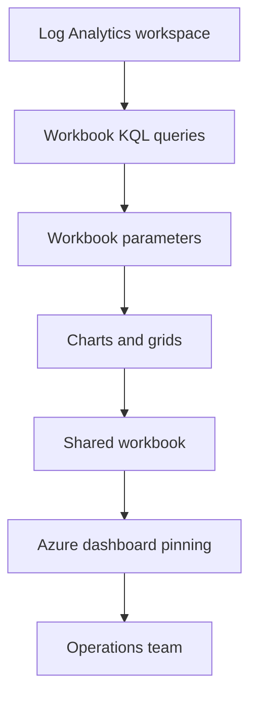

---
content_sources:
  diagrams:
    - id: architecture-diagram
      type: flowchart
      source: mslearn-adapted
      based_on:
        - https://learn.microsoft.com/en-us/azure/azure-monitor/visualize/workbooks-overview
        - https://learn.microsoft.com/en-us/azure/azure-monitor/visualize/workbooks-create-workbook
        - https://learn.microsoft.com/en-us/azure/azure-portal/azure-portal-dashboards
        - https://learn.microsoft.com/en-us/azure/azure-monitor/visualize/visualize-overview
---

# Lab 05: Workbooks and Dashboards

This lab turns raw telemetry and alert logic into shareable operational views. You will create a workbook backed by Azure Monitor queries, add parameters and visualizations, and publish a simple Azure dashboard for team consumption.

## Lab Metadata

| Attribute | Value |
|---|---|
| Difficulty | Intermediate |
| Estimated Duration | 35-50 minutes |
| Azure Monitor Tier | Visualization and reporting |
| Primary Services | Azure Monitor workbooks, Azure dashboards, Log Analytics |
| Skills Practiced | Visualization, parameters, dashboard publishing, validation |

## Prerequisites

- Complete [Lab 01](lab-01-log-analytics-workspace-setup.md) and preferably [Lab 02](lab-02-custom-kql-queries.md).
- Azure CLI authenticated with `az login`.
- A Log Analytics workspace with recent `Heartbeat`, `Perf`, `AzureMetrics`, or Application Insights data.
- Permission to create workbooks and dashboards in the sandbox resource group.

Set variables:

```bash
export RG="rg-monitoring-lab01"
export LOCATION="koreacentral"
export WORKSPACE_NAME="lawmonlab01"
export WORKBOOK_NAME="wb-monitoring-lab05"
export WORKBOOK_DISPLAY_NAME="Monitoring Lab Workbook"
export DASHBOARD_NAME="dashboard-monitoring-lab05"

export WORKSPACE_ID=$(az monitor log-analytics workspace show \
    --resource-group "$RG" \
    --workspace-name "$WORKSPACE_NAME" \
    --query "id" \
    --output tsv)
```

## Architecture Diagram

<!-- diagram-id: architecture-diagram -->


## Lab Objectives

- Create a shared workbook in the resource group.
- Use serialized workbook content so the configuration is repeatable.
- Build visuals from metrics and KQL queries.
- Publish a simple Azure dashboard using source-controlled JSON.
- Validate that the workbook and dashboard render current data.

## Step-by-Step Instructions

### Step 1: Inspect existing workbooks and dashboards

```bash
az monitor workbook list \
    --resource-group "$RG" \
    --query "[].{name:name,displayName:displayName,kind:kind}" \
    --output table
```

```bash
az portal dashboard list \
    --resource-group "$RG" \
    --query "[].{name:name,location:location}" \
    --output table
```

This prevents duplicate artifacts and gives you a baseline before creation.

### Step 2: Prepare workbook content

The workbook can contain parameters and KQL items. The following serialized structure is an example pattern you can store in source control:

```json
{
  "version": "Notebook/1.0",
  "items": [
    {
      "type": 9,
      "content": {
        "version": "KqlParameterItem/1.0",
        "parameters": [
          {
            "id": "timeRange",
            "name": "Time Range",
            "type": 4,
            "value": "PT1H"
          }
        ]
      }
    },
    {
      "type": 3,
      "content": {
        "version": "KqlItem/1.0",
        "query": "Heartbeat | where TimeGenerated > ago(1h) | summarize ActiveAgents=dcount(Computer)"
      }
    }
  ]
}
```

Use a checked-in JSON file for production-quality workflow. For the lab, save your serialized workbook to a local file such as `./docs/examples/monitoring-lab-workbook.json`.

### Step 3: Create the workbook

```bash
az monitor workbook create \
    --name "$WORKBOOK_NAME" \
    --resource-group "$RG" \
    --location "$LOCATION" \
    --display-name "$WORKBOOK_DISPLAY_NAME" \
    --kind "shared" \
    --serialized-data @./docs/examples/monitoring-lab-workbook.json \
    --output json
```

Read the workbook back:

```bash
az monitor workbook show \
    --name "$WORKBOOK_NAME" \
    --resource-group "$RG" \
    --query "{name:name,displayName:displayName,kind:kind,location:location}" \
    --output json
```

### Step 4: Validate workbook queries directly

```bash
az monitor log-analytics query \
    --workspace "$WORKSPACE_ID" \
    --analytics-query "Heartbeat | where TimeGenerated > ago(1h) | summarize ActiveAgents=dcount(Computer)" \
    --output table
```

```bash
az monitor log-analytics query \
    --workspace "$WORKSPACE_ID" \
    --analytics-query "Perf | where TimeGenerated > ago(1h) | where ObjectName == 'Processor' and CounterName == '% Processor Time' | summarize AvgCpu=avg(CounterValue) by bin(TimeGenerated, 5m)" \
    --output table
```

These checks make sure the workbook visuals are backed by working queries before you publish broadly.

### Step 5: Prepare dashboard JSON

An Azure dashboard definition can reference metrics, workbook resources, and pinned parts. Keep the file in source control for repeatability.

Example design goals:

- Show one markdown tile with lab context.
- Show one metric chart or workbook pin for CPU trend.
- Show one tile for active agent count.

### Step 6: Create the Azure dashboard

```bash
az portal dashboard create \
    --resource-group "$RG" \
    --name "$DASHBOARD_NAME" \
    --location "$LOCATION" \
    --input-path ./docs/examples/monitoring-lab-dashboard.json \
    --tags owner=monitoring tier=lab \
    --output json
```

Review the dashboard:

```bash
az portal dashboard show \
    --resource-group "$RG" \
    --name "$DASHBOARD_NAME" \
    --query "{name:name,location:location,tags:tags}" \
    --output json
```

### Step 7: Update workbook content when queries evolve

If you refine the workbook JSON, update the resource rather than creating a duplicate:

```bash
az monitor workbook update \
    --name "$WORKBOOK_NAME" \
    --resource-group "$RG" \
    --serialized-data @./docs/examples/monitoring-lab-workbook.json \
    --output json
```

This pattern is especially important when dashboards depend on stable workbook identifiers.

### Step 8: Review artifacts as a team-facing package

```bash
az monitor workbook list \
    --resource-group "$RG" \
    --query "[].{name:name,displayName:displayName}" \
    --output table
```

```bash
az portal dashboard list \
    --resource-group "$RG" \
    --query "[].{name:name,location:location}" \
    --output table
```

## Validation Steps

Run these checks before finishing the lab:

1. Confirm the workbook exists and is shared.

```bash
az monitor workbook show \
    --name "$WORKBOOK_NAME" \
    --resource-group "$RG" \
    --query "{name:name,kind:kind,displayName:displayName}" \
    --output json
```

2. Confirm the dashboard exists in the same resource group.

```bash
az portal dashboard show \
    --resource-group "$RG" \
    --name "$DASHBOARD_NAME" \
    --query "{name:name,location:location}" \
    --output json
```

3. Confirm that workbook-backed queries still return data.

```bash
az monitor log-analytics query \
    --workspace "$WORKSPACE_ID" \
    --analytics-query "union isfuzzy=true Heartbeat, Perf, AzureMetrics | where TimeGenerated > ago(1h) | summarize Records=count() by Type" \
    --output table
```

Validation succeeds when the workbook and dashboard exist, the workbook is marked shared, and the source queries return current rows.

## Cleanup Instructions

To remove just the visualization assets:

```bash
az portal dashboard delete \
    --resource-group "$RG" \
    --name "$DASHBOARD_NAME"
```

```bash
az monitor workbook delete \
    --name "$WORKBOOK_NAME" \
    --resource-group "$RG" \
    --yes
```

If the entire sandbox is no longer needed, delete the resource group instead.

## See Also

- [Operations: Workbooks and Dashboards](../../operations/workbooks-and-dashboards.md)
- [Reference: CLI Cheatsheet](../../reference/cli-cheatsheet.md)
- [Tutorials Index](../index.md)

## Sources

- [Azure Monitor workbooks overview](https://learn.microsoft.com/en-us/azure/azure-monitor/visualize/workbooks-overview)
- [Create interactive reports with Azure Monitor workbooks](https://learn.microsoft.com/en-us/azure/azure-monitor/visualize/workbooks-create-workbook)
- [Azure dashboards](https://learn.microsoft.com/en-us/azure/azure-portal/azure-portal-dashboards)
- [Visualize data in Azure Monitor](https://learn.microsoft.com/en-us/azure/azure-monitor/visualize/visualize-overview)
